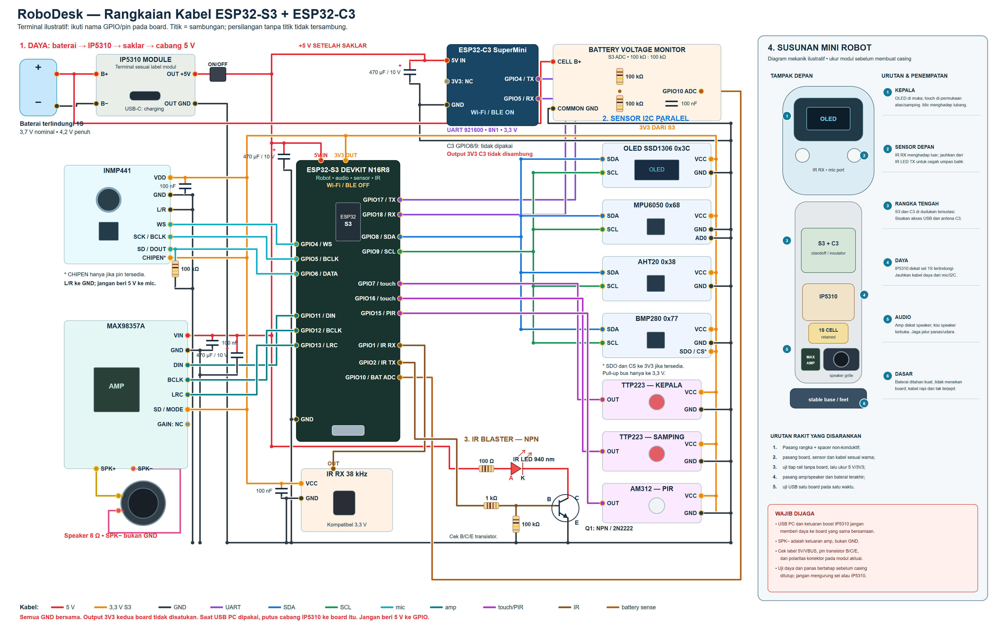
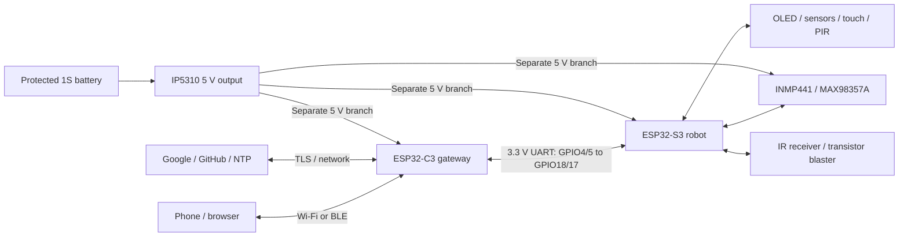

# RoboDesk: ESP32-S3 robot + ESP32-C3 gateway

The pair is opt-in (`ROBODESK_DUAL_BOARD=1`). The S3 DevKit N16R8 owns all peripherals, behavior, memory, local recognition and audio. The C3 SuperMini owns Wi-Fi, BLE, dashboard, NTP and TLS. S3 does not initialize either radio. Existing standalone builds remain available.

## Assembly cable diagram

[Open the SVG to zoom without losing detail](robodesk-s3-c3-assembly-wiring.svg). The single image combines the full electrical wiring with a front view and compact placement guide for the mini robot. Every electrical connection is drawn as a continuous cable with explicit connection nodes. Crossings without a dot are insulated, separate wires. Terminal positions and the body layout are illustrative; use the printed GPIO/terminal labels on your actual boards and measure the actual module dimensions before fabricating a case. All pictured S3/C3 and peripheral grounds share the common return.

This drawing is generated from explicit paths in [draw_dual_board_wiring.py](../../tools/draw_dual_board_wiring.py). The SVG is the current source of truth and stays sharp when zoomed. It shows the separate 5 V branches, S3-only 3.3 V peripheral supply, UART/I2S GPIOs, speaker output pair, battery divider, NPN IR driver, and recommended compact component placement. Clone board labels and transistor lead order vary, so verify them before connecting power. This is an assembly guide; the device is currently unavailable and the wiring has not been physically validated.

All branches share ground. Each ESP32 board uses its own 3.3 V regulator.

## Wiring

| Connection | ESP32-S3 | ESP32-C3 / peripheral |
|---|---:|---|
| UART S3 → C3 | GPIO17 TX | C3 GPIO5 RX |
| UART C3 → S3 | GPIO18 RX | C3 GPIO4 TX |
| Common reference | GND | C3 GND; all peripheral GND |
| I2C SDA / SCL | GPIO8 / GPIO9 | OLED, MPU6050, AHT20, BMP280 |
| Head / side touch | GPIO7 / GPIO16 | TTP223 OUT |
| PIR | GPIO15 | AM312 OUT |
| Microphone WS / BCLK / DATA | GPIO4 / GPIO5 / GPIO6 | INMP441 |
| Speaker DIN / BCLK / LRC | GPIO11 / GPIO12 / GPIO13 | MAX98357A |
| IR receiver | GPIO1 | 3.3 V compatible 38 kHz receiver OUT |
| IR transmitter | GPIO2 | Transistor driver, active high |
| Battery monitor | GPIO10 / ADC1 | Midpoint of 100 kOhm:100 kOhm divider across IP5310 battery B+ / B− |

Both UART wires use **3.3 V logic**, 921600 baud, 8N1. Keep wires short and route with ground away from speaker/power wiring. The S3 GPIO18 UART pin is distinct from the C3 GPIO18/19 USB pins. Leave C3 GPIO8/9 unused; the previous standalone IR diagram does not apply to this architecture.

### Additional module terminals

| Module terminal | Connection |
|---|---|
| OLED, MPU6050, AHT20, BMP280 VCC / GND | S3 3V3 / common GND |
| MPU6050 AD0 | GND for address 0x68 |
| BMP280 SDO / CS, if exposed | S3 3V3 / S3 3V3 for I2C at 0x77 |
| Both TTP223 and AM312 VCC / GND | S3 3V3 / common GND |
| INMP441 VDD / GND / L/R | S3 3V3 / GND / GND |
| INMP441 CHIPEN, if exposed | S3 3V3 |
| INMP441 SD pulldown / supply decoupling | 100 kOhm SD-to-GND / 100 nF VDD-to-GND |
| MAX98357A VIN / GND / SD-MODE / GAIN | 5 V / GND / S3 3V3 / unconnected |
| MAX98357A SPK+ / SPK- | Speaker + / speaker -; neither output to GND |
| IR receiver VCC / GND | S3 3V3 / common GND; use a receiver specified for 3.3 V |
| Battery divider | IP5310 battery B+ → 100 kOhm → S3 GPIO10; GPIO10 → 100 kOhm → IP5310 B− / common GND; 100 nF from GPIO10 to GND |

Microphone auxiliary terminals follow the [TDK INMP441 datasheet](https://product.tdk.com/system/files/dam/doc/product/sw_piezo/mic/mems-mic/data_sheet/inmp441.pdf); amplifier channel selection and speaker output connections follow the [Analog Devices MAX98357A datasheet](https://www.analog.com/media/en/technical-documentation/data-sheets/MAX98357A-MAX98357B.pdf?ADICID=SYND_WW_P682800_PF-spglobal).

## Battery and power

Use a protected **1S Li-ion/LiPo battery** on the IP5310 B+/B− battery terminals. Confirm the exact module's output/protection/current rating and Type-C negotiation behavior; B+/B− are not 5 V outputs. Route its rated switched 5 V output to separate branches for S3 5V IN, C3 5V IN and MAX98357A VIN. Add 470 µF bulk capacitance at each branch and use short, adequately sized conductors. The three grounds meet near the source. Never tie the board regulators' 3.3 V outputs together. Peripheral logic power comes from the S3 regulator. Speaker SPK+/SPK− connect only to the speaker.

Disconnect the IP5310 boost branch to a board before connecting that board to a PC USB supply. Do not connect two VBUS sources together. A 5 V boost supply does not establish that the S3's 3.3 V regulator is healthy: validate that rail under simultaneous audio and gateway-radio load. Keep brownout detection enabled.

For the active-high blaster, use a 940 nm IR LED and NPN driver: +5 V → 100 Ω resistor → LED anode; LED cathode → transistor collector; emitter → GND. S3 GPIO2 → 1 kΩ → base; add 100 kΩ base-to-emitter pull-down. Confirm transistor pinout. This limits nominal LED current to approximately 35 mA; it is a modest-range starting circuit. Receiver VCC uses 3.3 V, with local 100 nF decoupling. The old active-low PNP illustration is superseded.

## Bring-up and migration

1. Build without embedded credentials: `tools/build_dual_board.ps1 -Board both`. Outputs are staged under `.verification/dual-board/{gateway,robot}/build`. `secrets.example.h` is substituted as `secrets.h`.
2. Flash each matching profile through its own USB using the existing dual-slot partition layout. Preserve the S3 WakeNet model partition; never flash a C3 image onto S3 or an old S3-only pin map onto C3. The initial pair requires USB flashing of both profiles.
3. Wire the UART and common ground. Start each board separately, then together. C3 dashboard remains reachable if S3 is unavailable; commands requiring the S3 return 503.
4. Migration is closed by default. From the **S3 USB serial console** at 115200 baud, send `pair_migrate` followed by newline. This opens a 60-second physical-service window; C3 retries every 10 seconds. During this window UART carries the backed-up network/API/PIN settings in plaintext, so connect only the intended C3 on trusted wiring. Populated C3 credentials are retained. C3 persists missing credentials and an import ID, then acknowledges the same ID; S3 erases the secret-bearing backup after acknowledgement. If interrupted, reopen the USB window. Ordinary behavior/settings RPC excludes credentials. Enter credentials directly in the C3 dashboard if migration is unwanted.
5. Pair the phone again against the C3 BLE identity. Bluetooth bonds cannot be assumed portable between boards. Existing notification allowlist and app/snippet behavior are preserved.
6. Inspect `/api/status`: `robot`, `gateway`, `boardLink`, `robotConnected`, `robotStatusStale`. Verify reset reasons, UART retry/CRC counters, both heap reserves, clock validity and audio counters.

## Operation and updates

S3 retains Gemini parsing/base64/audio buffers in PSRAM. C3 forwards a bounded TLS byte stream to the fixed Google host and injects its API key into the initial request. Only one TLS AI tunnel runs at a time; background memory extraction temporarily pauses the Live session. Mic privacy is enforced on S3 before any voice data enters the tunnel. C3 radio loss does not stop local robot activities.

Factory reset records a durable C3 intent before clearing S3. S3 removes its migration backup and learned IR data and stores a reset tombstone, so old credentials cannot be imported again. C3 records the S3 acknowledgement before erasing its own settings. An interrupted reset resumes after reboot/reconnection; keep both boards powered and connected until both restart. A pending reset returns HTTP 202. OTA anti-rollback version metadata is retained.

Signed releases for the pair must include `manifest-s3-robot.txt` / `RoboDesk-s3-robot.bin` and `manifest-c3-gateway.txt` / `RoboDesk-c3-gateway.bin` plus signatures. Prepare all standalone and paired assets with `tools/prepare_github_release.ps1 -Repository akh-211/robodesk -Version <next-version> -DualBoard`. This command prepares/signs assets; it does not publish them.

Dashboard GitHub update checks both manifests and requires matching release versions. It installs S3 first, waits for its rollback self-test and committed version, then installs C3. Role-bound signatures include `robot-link-v1` or `gateway-link-v1`; standalone images cannot be installed through the paired updater. Version 1 is the common link contract. UART/network failure leaves the active slot usable; retries restart the image transfer. USB remains the recovery path.

IR actions are `ir_learn` (10-second window, optional name), `ir_send` (up to eight hexadecimal NEC code digits, transmitted LSB first), and `ir_replay` (named profile or most recently learned 38 kHz signal). Up to four raw profiles are stored in S3 NVS; legacy single-signal data is migrated on boot. Captures remain limited to 63 symbols and 150 ms. RMT captures and transmits independently of I2S audio tasks.

The battery monitor reads the protected 1S cell through a 1:1 divider on S3 GPIO10 (ADC1). It reports voltage and advisory low/critical bands; it does not estimate an exact state of charge or control power-off. Confirm the measured value against a multimeter before relying on alerts. ADC pin voltage must stay below the S3 input limit; do not connect the cell directly to GPIO10.

## Hardware qualification remains the final stage

Test each board independently, then UART, sensors, audio, BLE/Wi-Fi, and IP5310 power. Exercise two-way audio and dashboard concurrently; unplug UART/C3/internet; restart either board; try wrong-role signatures and interrupted transfers; verify rollback. Monitor full load for at least two hours with no unexpected reset or brownout. C3 targets: internal free heap ≥48 KiB and largest free block ≥24 KiB during combined load. These are acceptance targets, not measurements already achieved.
