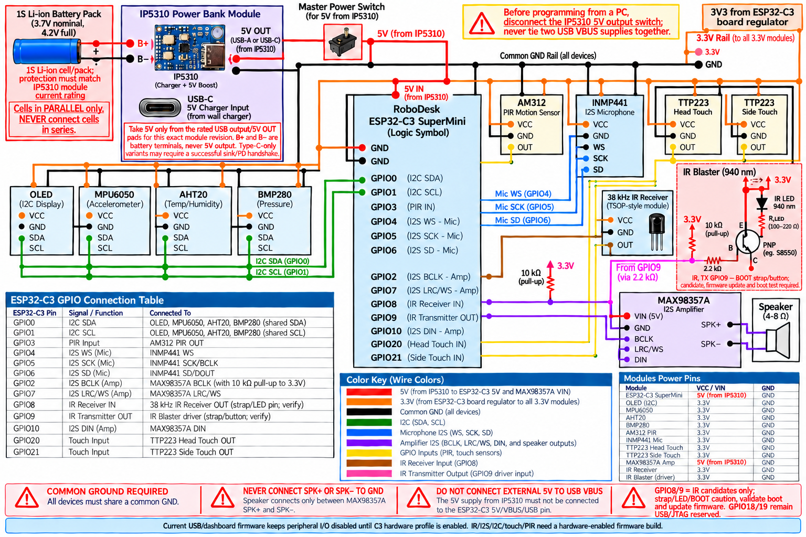

# RoboDesk ESP32-C3 SuperMini wiring

For the S3 + C3 pair, use [dual-board wiring](dual-board-wiring.md). In that profile the C3 has no robot peripherals, UART uses GPIO4/5, and IR is on S3 GPIO1/2. The diagram below applies only to the standalone C3 proposal.

This is the selected pin map for the ESP32-C3 SuperMini 4 MB target. GPIO8 and GPIO9 are proposed IR pins only: both are strapping pins, GPIO9 is commonly the BOOT button, and GPIO8 may affect ROM boot output. Validate boot/recovery with the exact board before connecting IR hardware, and keep these peripherals disabled until a hardware-enabled firmware profile is prepared. GPIO18/19 stay reserved for native USB Serial/JTAG. GPIO2 is an I2S clock output and needs a 10 kOhm pull-up to 3.3 V so it is not left floating during reset.



## Board connections

| RoboDesk signal | SuperMini GPIO | Connect to |
| --- | ---: | --- |
| I2C SDA | 0 | OLED, MPU6050, AHT20, BMP280 SDA |
| I2C SCL | 1 | OLED, MPU6050, AHT20, BMP280 SCL |
| PIR input | 3 | AM312 OUT |
| Microphone WS/LRCLK | 4 | INMP441 WS |
| Microphone BCLK/SCK | 5 | INMP441 SCK |
| Microphone data | 6 | INMP441 SD/DOUT |
| Speaker BCLK | 2 | MAX98357A BCLK; add 10 kOhm from GPIO2 to 3.3 V |
| Speaker LRC/WS | 7 | MAX98357A LRC |
| Speaker data | 10 | MAX98357A DIN |
| Head touch input | 20 | Head TTP223 OUT |
| Side touch input | 21 | Side TTP223 OUT |
| IR receiver output | 8 (candidate; strap pin) | 38 kHz demodulating receiver OUT, with 10 kOhm pull-up to 3.3 V |
| IR blaster driver input | 9 (candidate; BOOT/strap pin) | Transistor driver input through 2.2 kOhm; verify active polarity and boot behavior |

## Power and signal notes

- Power the C3, INMP441, OLED, touch modules, and I2C sensors from regulated 3.3 V. All modules must share ground.
- Power MAX98357A VIN from a stable 5 V rail with enough current for the speaker. Share ground with the C3; never power the amplifier from the C3 3.3 V pin. Do not join a separate 5 V rail to USB VBUS while the C3 is connected to a computer.
- Connect a protected 1-cell Li-ion/LiPo pack (3.0–4.2 V) only to the IP5310 module's B+ and B− battery pads. Never connect the cell to its 5 V output, and never connect cells in series. Use the module's rated 5 V OUT/USB output for the C3 5V input and MAX98357A VIN; do not use B+/B− as a 5 V source. Check the exact IP5310 board revision, protection/current rating, and Type-C power negotiation behavior before assembly. Disconnect the IP5310 5 V boost output before connecting a PC USB cable so two VBUS supplies are not tied together.
- The IR transmitter uses a 940 nm LED with a transistor driver; do not drive the LED directly from a GPIO. The illustrated PNP circuit is active-low and uses a 2.2 kOhm base resistor plus a 10 kOhm pull-up. Confirm the transistor pinout and LED current/resistor values for the selected parts.
- GPIO8/GPIO9 are boot-strapping pins, so the IR circuits can affect startup. Test reset, cold boot, USB flashing, and recovery with the modules attached before enabling these pins in firmware. IR/I2S/I2C/touch/PIR remain disabled in the current USB/dashboard firmware.
- Keep I2C pull-ups at 3.3 V. If several breakout boards each include pull-ups, remove extras if the combined resistance is too low.
- Connect the speaker between MAX98357A SPK+ and SPK-. Neither speaker terminal connects to ground.
- Use 3.3 V logic. Check the exact PIR module before connecting OUT; level-shift it if that board can output more than 3.3 V.
- USB remains connected to the board's native USB connector for flashing and serial logs. GPIO20/21 are used by RoboDesk for touch inputs, so do not use UART0 on those pins.

## Firmware profiles

The default C3 firmware keeps I2C, touch/PIR inputs, and I2S disabled so the bare USB-connected board can boot into its dashboard. After installing this wiring, prepare the full C3 release with:

```powershell
.\tools\prepare_github_release.ps1 -Repository akh-211/robodesk -Version <next-version> -EnableC3Peripherals
```

Use a new, monotonically increasing release version. The C3 hardware-enabled build uses the same dual-slot partition table and signed OTA path as the USB-only profile.
